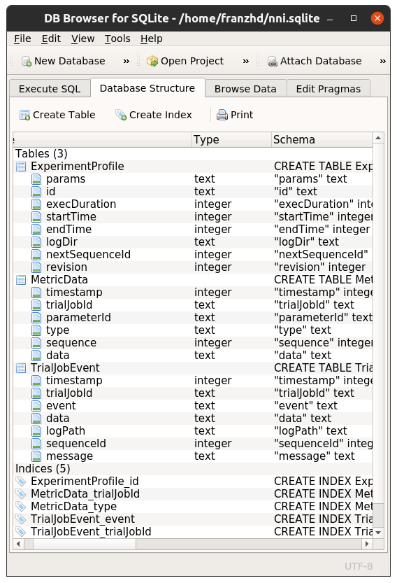

# How this work
i discovered that nni save in the result folder, under the name of the experiment, stuff other than the trials themself.

Among this stuff, i found a db.sqlite file that contains all the informations that nni shows in the web page.

I tought that acceding that in the fist place can be hard at first but then can simplify a lot the experiment evaluation.

Here there is a small description of the .sqlite and the procedure used for the data estraction.
____
## Explore the database

As we can se from the above screenshot, there are three main tables: _ExperimentProfile, MetricData, TrialJobEvent_.

- _ExperimentProfile_: Not used
- _MetricData_: Contains all the results metrics of the runned trials of that experiment.
- _TrialJobEvent_: Contains the paramenters chosen for each trials.

